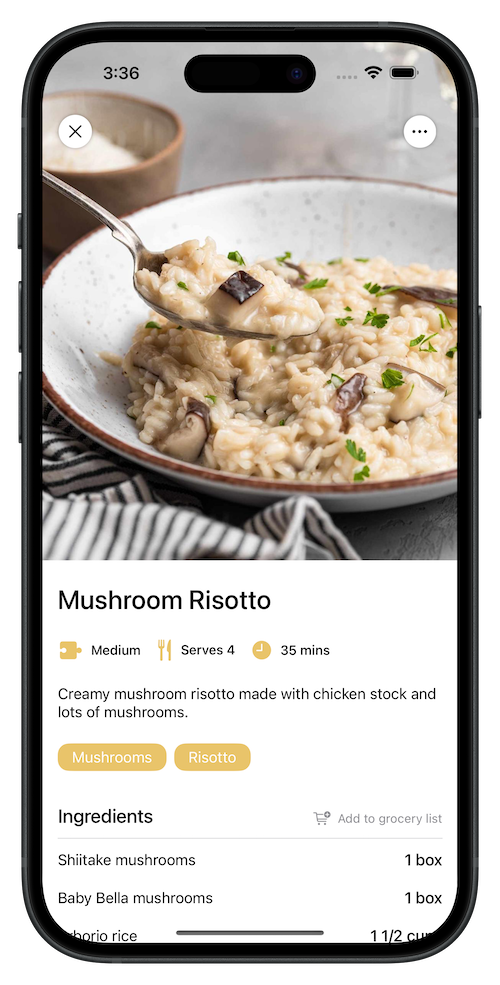

# 🥘 Recette

Recette is a mobile recipe management app that lets users create, edit, and organize their personal recipes. Built with a modern tech stack, the app supports image uploads, grocery list generation, and custom tagging, making it easier to keep track of your cooking habits and goals.

---

## ✨ Features

### Create & Edit Recipes  
Add recipes with titles, descriptions, steps, ingredients, tags, and images. Edit them seamlessly from within the app.

### Image Uploads  
Upload and store recipe images using Amazon S3.

### Custom Tagging System  
Users can create and apply custom tags (e.g., “vegetarian”, “quick”, “favorites”) for easier filtering and organization.

### Groceries Integration  
One-click ingredient-to-grocery list functionality, tied to the recipe and user account.

### Filtering & Search  
Filter recipes by tags or search by title for fast access to your saved meals.

  
  
  

---

## 🧰 Technologies Used

### Frontend  
#### 📱 iOS App (SwiftUI)
- Native iOS UI with dynamic state updates via `ObservableObject`
- Apollo iOS client for GraphQL API integration
- Photo upload using `PhotosPicker`
- Custom UI components: reusable tag chips, editable recipe steps, and drag-to-reorder interactions

### Backend  
#### Spring Boot (Java)
- REST + GraphQL APIs  
- Hibernate ORM for database operations  
- Validation layer to ensure data integrity  
- Entity relationships for recipes, users, tags, steps, and grocery items

#### GraphQL API
- Powered by Spring GraphQL  
- Used across iOS clients for real-time and structured data access

### Database  
#### PostgreSQL  
Schema includes:
- `recipes`, `ingredients`, `steps`, `recipe_tags`, `user_tags`, `groceries`, `users`, etc.

### Cloud & Storage  
- **Amazon S3**: stores recipe images and static assets  

---

## 🔮 Future Features

- **Recipe Sharing** – Let users share recipes publicly or with friends  
- **Meal Planning Calendar** – Schedule recipes over a weekly/monthly calendar  
- **Smart Tag Suggestions** – Auto-generate tags using AI based on content  
- **Nutritional Breakdown** – Estimate calories and basic nutritional info  
- **Offline Mode** – Edit and view recipes offline with sync on reconnect  
- **In-App Notifications** – Reminders for weekly and long-term goals  
- **Analytics Dashboard** – Track popular tags, goal completion, and recipe usage
